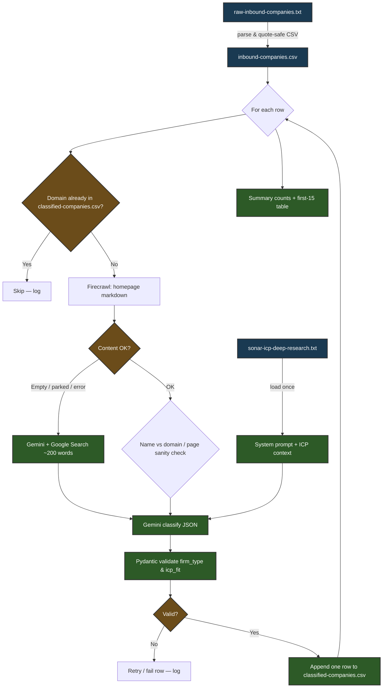

# Inbound ICP classification — architecture

[Back to README](../README.md)

```mermaid
graph TD
    A[raw-inbound-companies.txt] -->|parse & quote-safe CSV| B[inbound-companies.csv]
    C[sonar-icp-deep-research.txt] -->|load once| D[System prompt + ICP context]

    B --> E{For each row}
    E --> F{Domain already in classified-companies.csv?}
    F -->|Yes| G[Skip — log]
    F -->|No| H[Firecrawl: homepage markdown]

    H --> I{Content OK?}
    I -->|Empty / parked / error| J[Gemini + Google Search ~200 words]
    I -->|OK| K{Name vs domain / page sanity check}

    J --> L[Gemini classify JSON]
    K --> L
    D --> L

    L --> M[Pydantic validate firm_type & icp_fit]
    M --> N{Valid?}
    N -->|No| O[Retry / fail row — log]
    N -->|Yes| P[Append one row to classified-companies.csv]

    P --> E
    E --> Q[Summary counts + first-15 table]

    classDef data fill:#1a3a52,stroke:#333,stroke-width:2px,color:#fff;
    classDef step fill:#2d5a27,stroke:#333,stroke-width:2px,color:#fff;
    classDef decision fill:#6b4c1a,stroke:#333,stroke-width:2px,color:#fff;
    class A,C,B data;
    class D,J,L,M,P,Q step;
    class F,I,N decision;
```
